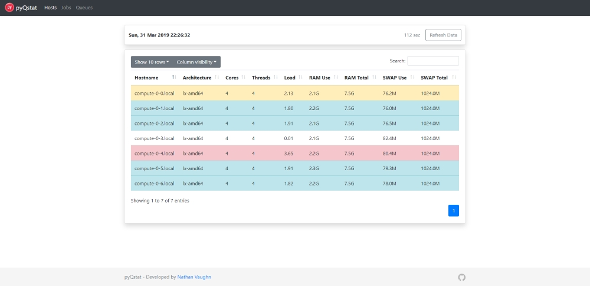

# pyQstat
[](https://github.com/ambv/black)

A small Python-based web app to display Sun Grid Engine (and forks) statistics.

## Screenshots

### Hosts



### Jobs

#### Overview


#### Single Job


### Queues


## Installation
Installation is the same as any other Flask-based application. It's highly dependent on your particular setup, but the general process for Apache is as follows:

```bash
# install the required Apache module
yum install mod_wsgi

# go into web directory
cd /var/www/html
# clone code
git clone https://github.com/NathanVaughn/pyQstat.git
# go into new directory
cd pyQstat

# install virtual env
pip install virtualenv
# create new virtual env
virtualenv venv
# activate the virtual env
source venv/bin/activate
# install the requirements
pip install -r requirements.txt
# deactivate virtual env
deactivate

# copy example wsgi file
cp pyQstat.wsgi.example pyQstat.wsgi
# edit wsgi file
nano pyQstat.wsgi
# make wsgi file executable
chmod a+x pyQstat.wsgi

# edit Apache config
# put this somewhere in your VirtualHost
WSGIScriptAlias /pyQstat /var/www/html/pyQstat/pyQstat.wsgi

# restart apache
service httpd restart
```

Also refer to [http://flask.pocoo.org/docs/1.0/deploying/mod_wsgi/](http://flask.pocoo.org/docs/1.0/deploying/mod_wsgi/)
